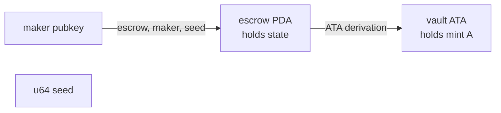
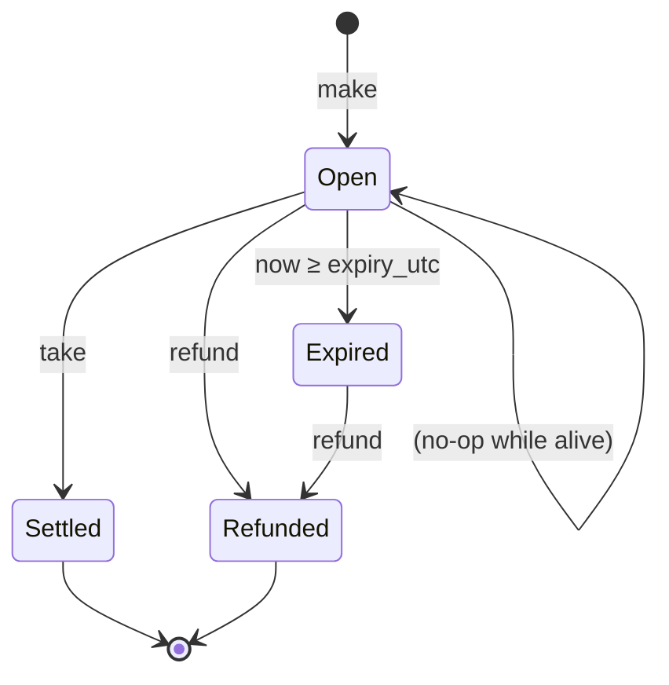
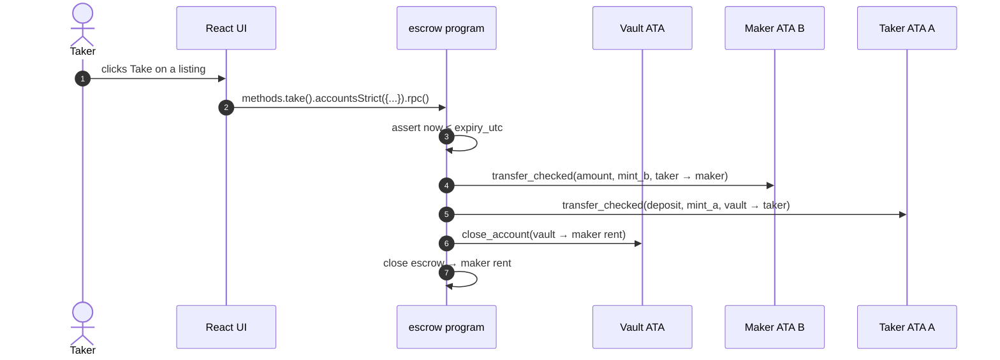

# Escrow

A Solana Anchor program that lets one party (`maker`) lock SPL tokens of mint `A` against an asking price in mint `B`. A second party (`taker`) atomically exchanges the two, and the `maker` can refund the offer at any time. Offers may optionally carry a UTC expiry the chain enforces it on both `make` and `take`.

The React frontend is a single page with three sections:

- **Make**: create a new escrow. The PDA is auto-saved to localStorage so you can find it after refresh.
- **Take by address**: paste any escrow PDA, see its terms, take it.
- **Your escrows**: escrows the connected wallet has made; click the address to copy it for sharing with a taker. Refund any open offer.

## Architecture


### Instructions

| Instruction | Args                                                                  | Effect                                                                                                                                                                       |
| ----------- | --------------------------------------------------------------------- | ---------------------------------------------------------------------------------------------------------------------------------------------------------------------------- |
| `make`      | `seed: u64`, `amount: u64`, `deposit: u64`, `expiry_utc: Option<i64>` | Creates the escrow PDA + vault ATA, transfers `deposit` of mint A from maker into the vault, records `amount` of mint B as the price. Rejects an expiry already in the past. |
| `take`      |                                                                       | Transfers `amount` of mint B from taker to maker, drains the vault (mint A) to taker, closes both vault + escrow. Rejects after expiry.                                      |
| `refund`    |                                                                       | Returns the vault contents to the maker and closes both accounts. No expiry check the maker can always reclaim funds.                                                        |

`deposit` and `amount` are decoupled: `deposit` is how much of mint A the maker locks; `amount` is what the taker must pay in mint B. They aren't required to match, which gives the maker price discretion.

### Account state

```rust
#[account]
pub struct Escrow {
    pub seed: u64,
    pub maker: Pubkey,
    pub mint_a: Pubkey,
    pub mint_b: Pubkey,
    pub amount: u64,
    pub bump: u8,
    pub expiry_utc: Option<i64>,
}
```

### PDAs

- `escrow` = `["escrow", maker, seed_le_bytes]` (program-owned account)
- `vault` = associated token account of `mint_a` for owner `escrow`



### Lifecycle



A taker can only act on **Open** escrows. After expiry the only legal transition is refund.

### Take flow



## Tests

```sh
anchor test
```

The suite lives under `programs/escrow/tests/`, written against [`anchor-litesvm`](https://crates.io/crates/anchor-litesvm). No JS/TS harness; clock warp and deterministic mints are easier in-Rust, and the program's `#[error_code]` enum is in scope so assertions can name errors directly.

A full run, 15 tests across the three instruction files:

```text
     Running unittests src/lib.rs
running 1 test
test test_id ... ok
test result: ok. 1 passed; 0 failed; 0 ignored; 0 measured

     Running tests/test_make.rs
running 6 tests
test make_works_no_expiry ... ok
test make_works_expiry ... ok
test make_locks_tokens_in_vault_and_initialises_escrow ... ok
test make_rejects_past_expiry ... ok
test deposit_and_amount_can_differ ... ok
test two_concurrent_escrows_use_distinct_seeds ... ok
test result: ok. 6 passed; 0 failed; 0 ignored; 0 measured

     Running tests/test_refund.rs
running 3 tests
test refund_returns_vault_and_closes_state ... ok
test refund_works_after_expiry ... ok
test refund_signer_must_match_escrow_maker ... ok
test result: ok. 3 passed; 0 failed; 0 ignored; 0 measured

     Running tests/test_take.rs
running 6 tests
test asymmetric_mint_decimals_are_pinned ... ok
test take_rejects_swapped_mints ... ok
test take_drains_vault_when_deposit_differs_from_amount ... ok
test take_settles_swap_and_closes_escrow ... ok
test take_after_expiry_fails_with_escrow_expired ... ok
test take_succeeds_before_expiry ... ok
test result: ok. 6 passed; 0 failed; 0 ignored; 0 measured
```

### Structured CPI logs

Calling `.print_logs_structured()` on a `TransactionResult` (or letting `send_ok` / `send_anchor_err` do it automatically when an assertion fires) prints the program invocation chain as a tree instead of as the flat `Program log:` dump that `solana-test-validator` emits. The compute units per frame come along for free. Here's `take_settles_swap_and_closes_escrow` running clean:

```text
=== Structured Transaction Logs ===
Transaction
└── 5YuYrfNC8emUaLBbHcu7AvyxNRgbvp9B5TaDehFz9g9K [1] ✓ 65457cu
    ├── ATokenGPvbdGVxr1b2hvZbsiqW5xWH25efTNsLJA8knL [2] ✓ 13416cu
    │   ├── TokenkegQfeZyiNwAJbNbGKPFXCWuBvf9Ss623VQ5DA [3] ✓ 183cu
    │   ├── 11111111111111111111111111111111 [3] ✓
    │   ├── TokenkegQfeZyiNwAJbNbGKPFXCWuBvf9Ss623VQ5DA [3] ✓ 38cu
    │   └── TokenkegQfeZyiNwAJbNbGKPFXCWuBvf9Ss623VQ5DA [3] ✓ 235cu
    ├── ATokenGPvbdGVxr1b2hvZbsiqW5xWH25efTNsLJA8knL [2] ✓ 13517cu
    │   ├── TokenkegQfeZyiNwAJbNbGKPFXCWuBvf9Ss623VQ5DA [3] ✓ 183cu
    │   ├── 11111111111111111111111111111111 [3] ✓
    │   ├── TokenkegQfeZyiNwAJbNbGKPFXCWuBvf9Ss623VQ5DA [3] ✓ 38cu
    │   └── TokenkegQfeZyiNwAJbNbGKPFXCWuBvf9Ss623VQ5DA [3] ✓ 235cu
    ├── TokenkegQfeZyiNwAJbNbGKPFXCWuBvf9Ss623VQ5DA [2] ✓ 105cu
    ├── TokenkegQfeZyiNwAJbNbGKPFXCWuBvf9Ss623VQ5DA [2] ✓ 105cu
    └── TokenkegQfeZyiNwAJbNbGKPFXCWuBvf9Ss623VQ5DA [2] ✓ 118cu
Compute Units: 65457
====================================
```

Reading top-down, the depth-2 frames map to:

1. `ATokenGPvbd...JA8knL` — `init_if_needed` on `taker_ata_a` (taker's ATA for mint A). Nested calls go: token-program existence check, system-program allocate, two more token-program calls (initialize + set authority).
2. `ATokenGPvbd...JA8knL` — same shape, this time for `maker_ata_b` (maker's ATA for mint B).
3. `Tokenkeg...Q5DA` — `transfer_checked` for `pay_maker` (mint B, taker -> maker).
4. `Tokenkeg...Q5DA` — `transfer_checked` for `release_to_taker` (mint A, vault -> taker, signed by the escrow PDA).
5. `Tokenkeg...Q5DA` — `close_account` on the vault, with the rent returned to the maker.

That's the entire `take` flow visible in one screen. When a test fails inside one of those frames, the tree still prints, so you can see which CPI tripped without grepping the flat log dump for `Program log: AnchorError`.

### Layout

```text
programs/escrow/
├── src/test_helpers.rs       # EscrowBundle: the index page for accounts
└── tests/
    ├── common/mod.rs         # setup_accounts, run_make, make_ix_with
    ├── test_make.rs
    ├── test_take.rs
    └── test_refund.rs
```

Files are split by instruction. (The earlier shape on `main` split by feature flag instead: `test_with_expiry.rs` vs `test_without_expiry.rs`. Since expiry is a property of every ix, that split scattered each ix's tests across two files; the per-ix layout lets you read top-to-bottom against one instruction at a time.)

### `EscrowBundle`: one place that lists every account

`EscrowBundle` in `src/test_helpers.rs` is the suite's **index page for accounts**: every pubkey any ix reads or inits is listed once, with per-field doc comments explaining role and lifecycle (signer, PDA, ATA owned by whom, init vs pre-existing). Field names double as a search dimension: `grep accs.vault tests/` finds every test that touches the vault.

```rust
#[derive(Bundle, Copy, Clone, Debug)]
pub struct EscrowBundle {
    pub maker: Pubkey,
    pub taker: Pubkey,
    pub mint_a: Pubkey,
    pub mint_b: Pubkey,
    pub maker_ata_a: Pubkey,
    pub maker_ata_b: Pubkey,
    pub taker_ata_a: Pubkey,
    pub taker_ata_b: Pubkey,
    pub escrow: Pubkey,
    pub vault: Pubkey,
}
```

The struct is gated behind `#[cfg(not(target_os = "solana"))]` so BPF program builds don't pull in `anchor-litesvm`.

### What the new ergonomics removed

The previous suite hand-rolled per-ix builders for `make`, `take`, and `refund`, each one re-typing the full account list as a `to_account_metas(None)` block plus a parallel `InstructionData::data()` block:

```rust
// before: utils.rs on main
pub fn refund_ix(&self) -> Instruction {
    Instruction {
        program_id: escrow::id(),
        accounts: escrow::accounts::Refund {
            escrow: self.escrow,
            maker: self.maker,
            maker_ata_a: self.maker_ata_a,
            mint_a: self.mint_a,
            vault: self.vault,
            system_program: SYSTEM_PROGRAM_ID,
            token_program: TOKEN_PROGRAM_ID,
        }
        .to_account_metas(None),
        data: escrow::instruction::Refund {}.data(),
    }
}
```

With `#[derive(Bundle)]`, a generated `From<EscrowBundle>` impl fills the accounts slot, so the call site collapses to one line:

```rust
// after
let ix = ctx.program().build_ix(accs.bundle, instruction::Refund {});
```

Transaction sending got the same treatment: `ctx.svm.send_ok(ix, &[&signer])` and `ctx.svm.send_anchor_err(ix, &[&signer], "EscrowExpired")` replace hand-rolled `Message::new` + `Transaction::new` + `send_transaction`. Naming the error string keeps the assertion next to the program's `#[error_code]` variant; no decoding `TransactionError` -> `InstructionError` -> `Custom(n)` to figure out which check fired.

The host-side scaffolding shrank to match: `tests/utils.rs` (242 lines, three per-ix builders) became `tests/common/mod.rs` (170 lines, mostly the documented `setup_accounts` helper and constants), with a documented 63-line `test_helpers.rs` carrying the bundle definition that every ix reuses.

### Adversarial tests mutate the bundle inline

Negative tests don't need a parallel `refund_ix_with_maker` helper that duplicates the boilerplate (which is what `main` had). The spoof reads at the call site, right next to the assertion that depends on it:

```rust
let mut spoofed = accs.bundle;
spoofed.maker = accs.taker.pubkey();      // pretend the taker is the maker
spoofed.maker_ata_a = accs.taker_ata_a;   //   and supply a matching ATA so we
                                          //   reach the has_one check
let ix = ctx.program().build_ix(spoofed, instruction::Refund {});
ctx.svm.send_anchor_err(ix, &[&accs.taker], "ConstraintHasOne");
```

### Two scaffolding invariants, two classes of swap bug

```rust
pub const MINT_A_DECIMALS: u8 = 6;
pub const MINT_B_DECIMALS: u8 = 9;
pub const DEPOSIT: u64        = 1_000_000;
pub const RECEIVE: u64        = 2_000_000_000;
```

`DEPOSIT != RECEIVE` and `MINT_A_DECIMALS != MINT_B_DECIMALS` look like the same idea ("use asymmetric numbers so swap bugs surface"), but they each catch a different class of bug, and they surface that bug in different ways. Worth pulling apart:

| Invariant | Bug it catches | How it surfaces | Test that exercises it |
| --- | --- | --- | --- |
| `DEPOSIT != RECEIVE` (with a ~750x ratio) | A `take` that confused `vault.amount` (what's locked) with `escrow.amount` (the price) | A wrong post-balance: the taker would receive `RECEIVE` of mint_a instead of `DEPOSIT`, and the assertions trip | `take_drains_vault_when_deposit_differs_from_amount` |
| `MINT_A_DECIMALS != MINT_B_DECIMALS` | A `take` that confused `mint_a` with `mint_b` (wrong CPI account or wrong `decimals` constant) | First as an Anchor account-validation failure (`has_one = mint_a`, `associated_token::mint = mint_a`); if those ever regressed, SPL `transfer_checked` would still reject the CPI because passed decimals wouldn't match the on-chain mint | `take_rejects_swapped_mints` (active defense); `asymmetric_mint_decimals_are_pinned` (pins the constant so the dormant defense doesn't quietly go stale) |

So the decimals difference is an experiment (i left it in to show a regression test), mostly belt-and-suspenders: under the current `Take` constraints (`has_one`, `associated_token::mint`), a mint-pubkey swap fails before any `transfer_checked` runs, and `take_rejects_swapped_mints` is what asserts that. The asymmetric decimals would carry the defense if those constraints ever regressed. The `asymmetric_mint_decimals_are_pinned` test exists only to lock the constant in place; if someone flattens both mints to the same decimals, that test trips and the second line of defense is gone.

## Running the frontend

1. Start a local validator (pick one):

    ```sh
    solana-test-validator
    # or
    surfpool
    ```

2. Build + deploy the program:

    ```sh
    anchor build
    anchor deploy
    ```

3. Mint two test tokens to your wallet so you have something to escrow:

    ```sh
    spl-token create-token
    spl-token create-account <mintA>
    spl-token create-account <mintB>
    spl-token mint <mintA> 1000
    spl-token mint <mintB> 1000
    ```

4. Point the frontend at the validator and run the dev server:

    ```sh
    echo 'VITE_RPC_URL=http://127.0.0.1:8899' > .env.local
    yarn dev
    ```

5. Open the printed URL, connect a wallet set to **Localnet**, paste the two mint addresses into the Make form, click "Create escrow". Copy the resulting escrow PDA (click it on the card) and paste it into the **Take by address** form from a second wallet to fill the offer.

### Build / lint / format

```sh
yarn build
yarn typecheck
yarn lint
yarn format
yarn format:check
```
