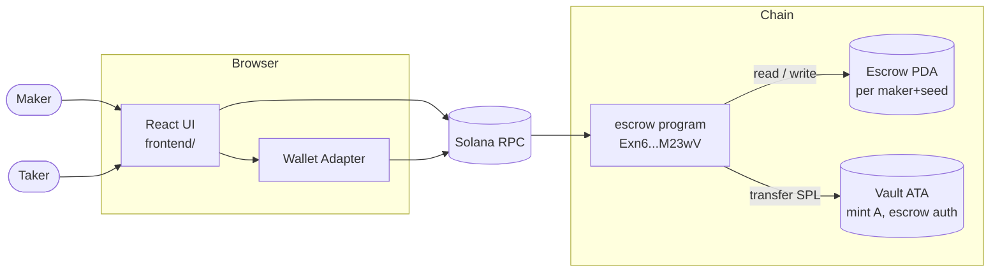
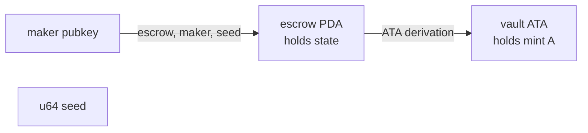
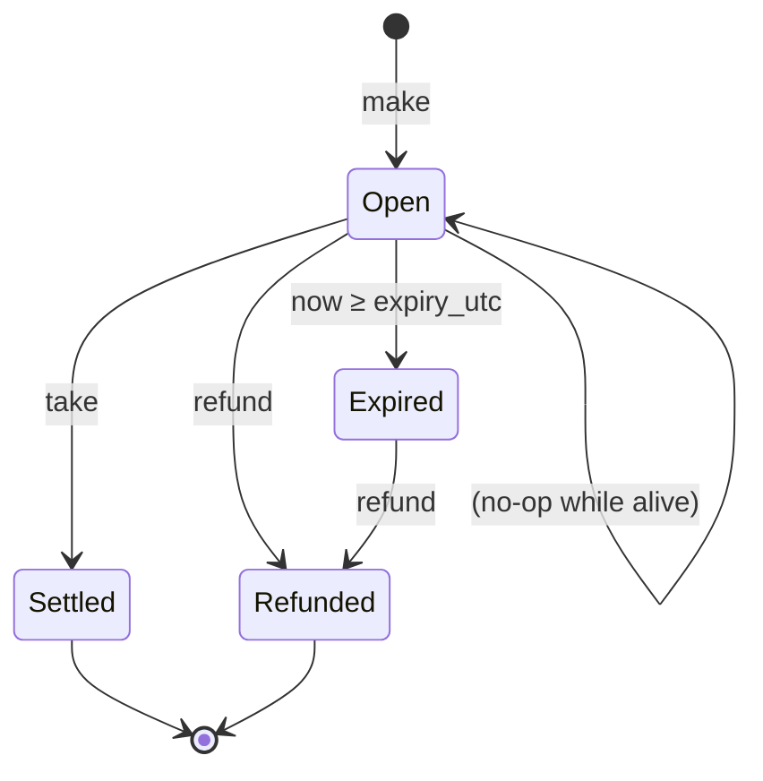
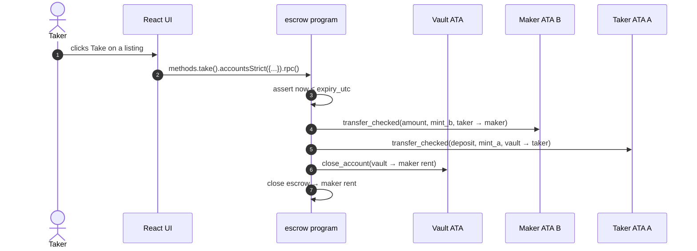

# Escrow

A Solana Anchor program that lets one party (`maker`) lock SPL tokens of mint `A` against an asking price in mint `B`. A second party (`taker`) atomically exchanges the two, and the `maker` can refund the offer at any time. Offers may optionally carry a UTC expiry the chain enforces it on both `make` and `take`.

A React frontend exposes two pages:

- **Browse**: public list of every active escrow.
- **Manage**: make new offers and refund the ones you own.

## Architecture



### Instructions

| Instruction | Args                                                                  | Effect                                                                                                                                                                       |
| ----------- | --------------------------------------------------------------------- | ---------------------------------------------------------------------------------------------------------------------------------------------------------------------------- |
| `make`      | `seed: u64`, `amount: u64`, `deposit: u64`, `expiry_utc: Option<i64>` | Creates the escrow PDA + vault ATA, transfers `deposit` of mint A from maker into the vault, records `amount` of mint B as the price. Rejects an expiry already in the past. |
| `take`      |                                                                       | Transfers `amount` of mint B from taker to maker, drains the vault (mint A) to taker, closes both vault + escrow. Rejects after expiry.                                      |
| `refund`    |                                                                       | Returns the vault contents to the maker and closes both accounts. No expiry check the maker can always reclaim funds.                                                        |

`deposit` and `amount` are decoupled: `deposit` is how much of mint A the maker locks; `amount` is what the taker must pay in mint B. They aren't required to match, which gives the maker price discretion.

### Account state

```rust
#[account]
pub struct Escrow {
    pub seed: u64,
    pub maker: Pubkey,
    pub mint_a: Pubkey,
    pub mint_b: Pubkey,
    pub amount: u64,
    pub bump: u8,
    pub expiry_utc: Option<i64>,
}
```

### PDAs

- `escrow` = `["escrow", maker, seed_le_bytes]` (program-owned account)
- `vault` = associated token account of `mint_a` for owner `escrow`



### Lifecycle



A taker can only act on **Open** escrows. After expiry the only legal transition is refund.

### Take flow



## Running tests

All tests are Rust LiteSVM (`programs/escrow/tests/`). No JS/TS suite — clock-warp + deterministic mints are easier in-Rust.

```sh
# Run the suite (Anchor invokes `cargo test`).
anchor test
```

## Running the frontend

1. Start a local validator (pick one):

    ```sh
    solana-test-validator
    # or
    surfpool
    ```

2. Build + deploy the program:

    ```sh
    anchor build
    anchor deploy
    ```

3. Mint two test tokens to your wallet so you have something to escrow:

    ```sh
    spl-token create-token
    spl-token create-account <mintA>
    spl-token create-account <mintB>
    spl-token mint <mintA> 1000
    spl-token mint <mintB> 1000
    ```

4. Point the frontend at the validator and run the dev server:

    ```sh
    echo 'VITE_RPC_URL=http://127.0.0.1:8899' > .env.local
    yarn dev
    ```

5. Open the printed URL, connect a wallet set to **Localnet**, and paste the two mint addresses into the Manage form.

### Build / lint / format

```sh
yarn build
yarn typecheck
yarn lint
yarn format
yarn format:check
```
